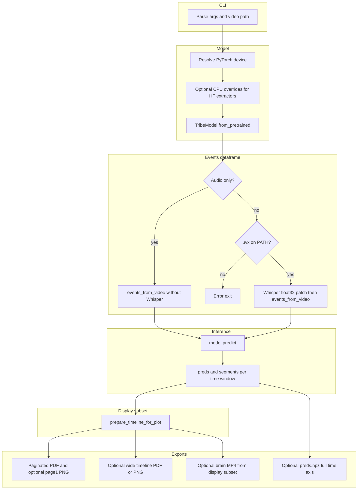

# TRIBE v2 video → PDF

Small integration around **[TRIBE v2](https://huggingface.co/facebook/tribev2)** (Meta / FAIR): load Facebook’s public checkpoint, run it on a **local video file**, and write a **multi-page PDF** of predicted cortical surface maps (with optional video thumbnails and transcribed text per time window).

This repo is glue code only; the model and licenses belong to Meta.

## What you get

- **`{name}_brain_report.pdf`** — A4-style pages with 2 or 4 brain panels per page (configurable), segment time range, and optional transcript snippets.
- Optionally **`--include-timeline`** for the original single ultra-wide “filmstrip” figure.
- Feature **cache** under `--cache-folder` so re-runs on the same video reuse extracted embeddings when TRIBE allows it.

## Pipeline

High-level flow of `scripts/ad_brain.py` (TRIBE handles feature extraction and segmentation inside `predict`):



The PDF/PNG timeline and MP4 use the **display subset** after `prepare_timeline_for_plot`; `--save-preds` stores the **full** `preds` from `predict`. On GitHub, this diagram renders automatically; other Markdown viewers may need a Mermaid plugin.

## Setup

1. Python environment with `torch`, `tribev2`, and dependencies (see Meta’s repo for the full stack).
2. **Hugging Face**: `hf auth login` with a token that can read `facebook/tribev2`.
3. **Gated Llama 3.2** (used inside TRIBE for text): request access on [meta-llama/Llama-3.2-3B](https://huggingface.co/meta-llama/Llama-3.2-3B) with the same HF account.
4. **Transcription** (default): `uv` / `uvx` on PATH so TRIBE can run WhisperX, or use `--audio-only-events` to skip words.

On Mac without CUDA, this project forces WhisperX **float32** on CPU and routes feature extractors to **CPU** when needed so the hub’s CUDA-only configs do not crash PyTorch.

## Usage

From the repository root:

```bash
python scripts/ad_brain.py path/to/video.mp4 --out-dir ./out --device mps
```

Common flags:

| Flag                  | Purpose                                    |
| --------------------- | ------------------------------------------ |
| `--out-dir`           | Where PDF/PNG/cache outputs go             |
| `--cache-folder`      | TRIBE / neuralset feature cache            |
| `--device`            | `auto`, `cuda`, `mps`, or `cpu`            |
| `--brains-per-page`   | `2` or `4`                                 |
| `--include-timeline`  | Also export the wide horizontal timeline   |
| `--no-stimuli`        | Brain maps only (no thumbnails / captions) |
| `--audio-only-events` | No WhisperX / `uvx`                        |
| `--figure-dpi`        | Raster quality for surfaces in the PDF     |

Run `python scripts/ad_brain.py --help` for the full list.

## Layout

- **`scripts/ad_brain.py`** — CLI entrypoint.
- **`lib/tribe_brain/report.py`** — Paginated PDF / first-page PNG export.
- **`lib/tribe_brain/support.py`** — Device/config helpers, Whisper patch, event building, timeline subsampling.

## References

- [facebook/tribev2 on Hugging Face](https://huggingface.co/facebook/tribev2)
- [facebookresearch/tribev2 on GitHub](https://github.com/facebookresearch/tribev2)
